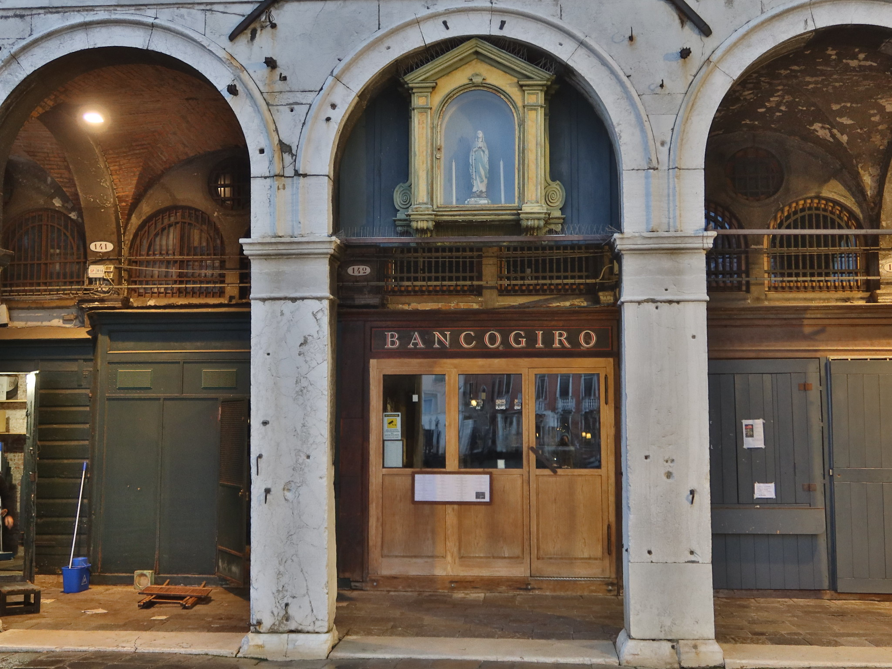

> Esta página ha sido generada automáticamente a partir del
> [fuente](https://github.com/JJ/redes-venecia/blob/main/redes-venecia.Rmd), que
> tiene una licencia libre y, como tal, puedes examinarlo para ver cómo se
> analizan los datos y se obtienen los resultados y los gráficos, y por supuesto
> copiar, modificar y republicar si lo deseas, siempre que se respete la
> [licencia](https://github.com/JJ/redes-venecia/blob/main/LICENSE).

```{r setup,echo=FALSE,message=FALSE}
source("R/utils.R") # Crea doges.sn, doges.sn.connected
```

Durante sus más de mil años de existencia, la república de Venecia fue gobernada
por `r length(data.doges$Years)` dogos. La estabilidad de la forma de estado y
su prosperidad económica en la época de apogeo tiene pocos paralelismos en la
historia medieval e incluso moderna. Y esta estabilidad se debe, en gran parte,
a un entendimiento y consiguiente control de las redes y sus comportamientos
emergentes. La prosperidad de Venecia se debió al control de las redes
comerciales en el Mediterráneo oriental y más allá; pero como comportamiento
emergente en esas redes comerciales apareció una red social basada en relaciones
económicas. De esa red de relaciones comerciales emergió una clase noble que
cerró el acceso al poder a otras clases emergentes, pero, a su vez, esa clase
noble creó una verdadera red matrimonial autoorganizada que a la vez impedía la
emergencia de una sola familia dominante y el acceso de otras clases no nobles
al poder. En la periferia de esas redes había muchas otras que se apoyaban entre
sí, pero sobre todo soportaban el poder de la red social de los nobles que
gobernaban la ciudad: una red de innovación tecnológica, redes urbanas
[@psarra2018role] y redes de intercambio de información e inteligencia
\cite{iordanou2019venice}, y las redes comerciales que siguieron teniendo
importancia incluso después de la graduación a redes sociales.

El poder de Venecia, mientras duró, atestigua el poder de las redes y
afortunadamente, la estabilidad del mismo y su obsesión con la información dejó
suficientes datos como para poder estudiarlo. En este informe nos fijaremos
principalmente en dos puntos neurálgicos de la red urbana de Venecia: Rialto y
su preponderancia comercial, y la Piazza San Marco y el Palacio de los Dogos y
su papel político, analizando dos redes sociales de las cuales tenemos datos: la
red de la *colleganza* o alianzas comerciales para fletar galeras, y la red
matrimonial de los dogos, o presidentes vitalicios de la república.

## Las redes comerciales de la *colleganza*

Aunque las primeras aventuras comerciales de Venecia, alrededor del año 1000, se organizaron alrededor del monopolio de la sal [@sal], el comercio sobre todo con el Oriente Medio (inicialmente controlado principalmente por el Imperio Bizantino, los reinos cristianos de Tierra Santa y otros reinos en Egipto y el norte de África) tuvo una gran expansión, sobre todo por la garantía ofrecida por el estado, que fabricaba y alquilaba las naves y proporcionaba seguridad militar (y también jurídica) durante el viaje. Sin embargo, la capacidad de las naves pronto necesitó la colaboración de de varias personas para el flete de las mismas, en un sistema llamado *Colleganza* [@spufford2014provision] en las que, generalmente, uno de los socios proporcionaba la inversión para la compra de mercancía, y otro acompañaba a la mercancía, ejerciendo de capitán de barco.

Estos contratos tenían lugar en el mercado de Rialto, que se ilustra a continuación. Más allá del puente que conocemos hoy, el área de Rialto que incluye el *campo* (que no plaza) de San Giacomo di Rialto, y las zonas contiguas hasta el mercado del pescado, llamado  *Mercato di Rialto*, incluía mercados, comercios, pero también bancos y una "cárcel comercial" en los bajos del Palacio dei Camarlenghi, que se ve a la derecha del puente, según se llega desde San Marco. Toda esta zona, en realidad el asentamiento original en la isla, está en una de las dos islas principales que forman Venecia, separadas por el Gran Canal. Precisamente las primeras salinas que se explotaron en Venecia estaba en esa misma isla. Por supuesto Rialto es uno de los centros de la red urbana veneciana, y nos servirá para comenzar a mostrar la evolución de las redes en Venecia y cómo su comportamiento emergente acaba caracterizando y rigiendo la historia de Venecia tal como la conocemos.



Estos contratos fueron analizados por Puga y Treffler [@colleganza], que también analizaron las posiciones en la red de las diferentes familias usando la centralidad de vectores propios \cite{BONACICH2007555}, una medida que refleja no sólo cómo está conectada una familia, sino también si las conexiones están a su vez conectadas. Sin embargo, hay otras medidas como el *page rank* \cite{BRIN1998107} que ofrecen una medida más global de esta cantidad. El componente principal de la red resultante se muestra a continuación.

```{r colleganza, echo=FALSE, message=F, fig.cap="Red *colleganza*, con el tamaño de los nombres de las familias reflejando su pagerank"}
colleganza <- read.csv("data/colleganza-pairs.csv", header=F)
colleganza.sn <- graph.data.frame(data.frame(colleganza$V1,colleganza$V2),directed=F)
E(colleganza.sn)$weight <- 1
colleganza.sn <- simplify(colleganza.sn, edge.attr.comb=list(weight="sum"))
V(colleganza.sn)$degree <- degree(colleganza.sn)
V(colleganza.sn)$pagerank <- unname(unlist(page_rank(colleganza.sn)$vector))


components <- igraph::clusters(colleganza.sn, mode="weak")
biggest_cluster_id <- which.max(components$csize)
vert_ids <- V(colleganza.sn)[components$membership == biggest_cluster_id]

colleganza.sn.connected <- igraph::induced_subgraph(colleganza.sn, vert_ids)

plot(colleganza.sn.connected,
     vertex.size=V(colleganza.sn.connected)$degree/2,
     layout=layout_with_fr,
     vertex.label.cex=0.5+V(colleganza.sn.connected)$pagerank*20,
     vertex.label.dist=0.5,
     edge.width=3*E(colleganza.sn.connected)$weight)
```

En la imagen se muestra solo el componente principal conectado. Este componente incluye el `r format(length(unique(V(colleganza.sn.connected)$name))/length(unique(V(colleganza.sn)$name)))`% de todas las familias, un total de `r length(unique(V(colleganza.sn)$name))`. La familia Viaro parece ser la principal en esta red, sobre todo por el número de conexiones, sin embargo se ve que hay otras familias, Morosini, Barbarigo, Giustinian e incluso empieza a apuntar la Contarini, no tanto por su pagerank, sino por la posición dentro de la red, que es bastante central. El grosor de la conexión indica el número de contratos entre esas familias; destacan la conexión Morosini-Bargarigo, pero también como hay un "cinturón" de familias fuertemente conectadas en torno al centro. Otras vamilias, como la Viaro, destacan por el número de conexiones, pero por la ausencia de conexión con familias a su vez muy conectadas.

Los datos de los contratos de *colleganza* llegan hasta `r max(colleganza$V3)`. En esa época tenía lugar un proceso constitucional denominado *Serrata* o cierre [@serata]. Este proceso regulaba el acceso al *Maggior Consiglio*, la asamblea encargada, entre otras cosas, de nombrar al dogo; sin embargo, aparte de esos deberes constitucionales, ingresar en el Consiglio era la antesala de una carrera política que incluía las múltiples asambleas, consejos, cargos burocráticos y magistraturas que regían la vida. La serrata no fue una sola ley, sino un conjunto de leyes implantadas en los 30 años aproximados que comienzan a finales del siglo XIII, y en la práctica significaba que sólo unas pocas familias erigidas como "nobles" podían ocupar esos cargos, incluyendo la máxima magistratura, ser Dogo.

Sin embargo, los que se convirtieron en nobles fueron los que tenían una mejor reputación, y aquellos cuya familia había estado mejor relacionada y por tanto los que efectivamente aparecen en esta red social cerca del centro (que, en esta representación que usa Fruchterman-Rheingold, son los que tienen mayor centralidad). Salvo el caso de los Viaro (que, en realidad, dejaron de estar presentes en la red bastantes años antes), los que pasaron a ser nobles fueron aquellas familias con más centralidad. Y de nobles, pasaron a dogos. Analizaremos algunos efectos secundarios de esta *Serrata* en la sección siguiente.

## La longevidad de los dogos una vez asumido el cargo

La *piazza* de San Marco en general, y el palacio de los dogos en particular, era la sede del poder político; a pesar de llamársele palacio "de los dogos" se trataba en realidad de la sede administrativa del gobierno de la República, incluyendo las principales instituciones: Maggior Consiglio, el Senado, las *procuratie* o fiscalías, incluyendo la más importante, la de San Marco; la misma capilla de San Marco era una capilla instucional y "de palacio", sirviendo antes al gobierno que a la Iglesia.


Los dogos, extraídos siempre de los nobles reconocidos a partir de la *Serrata*, solían pasar por una o más de esos puestos, siempre por designación o elección, antes de alcanzar el dogado. Sin embargo, la elección del dogo era una puesto *vitalicio*. ¿Cuanto duraban los dogos en el puesto? Lo presentamos en el siguiente gráfico

```{r longevidad, message=F, echo=F, fig.cap="Longevidad de los dogos frente al año de elección"}
library(ggthemes)
data("doges")
doges.years <- unique( data.frame(doge=data.doges$Doge,start=data.doges$Start,years=data.doges$Years))
doges.years$idx <- as.numeric(row.names(doges.years))
ggplot(doges.years, aes(x=start,y=idx))+geom_segment(aes(xend=start+years,yend=idx))+xlab("Year")+ylab("")+theme_economist()
```

Aparte de remarcar la longevidad de este régimen, y la ausencia de interrupciones, se puede ver que en general se trata de segmentos pequeños, salvo algunas excepciones: el segmento un poco más largo que se observa antes de 1500 fue el reinado de [Francesco Foscari](https://es.wikipedia.org/wiki/Francesco_Foscari), que fue obligado a dimitir. Este hecho fue observado por [@smith2021long], y se adujo que se debía tratar a una elección intencionada, más que a la casualidad. De hecho, analizando estadísticamente el punto de cambio en [@histories3010003] observamos que el punto de cambio corresponde aproximadamente a la mencionada *Serrata*.

Se pueden incluir muchas explicaciones al mismo, incluyendo la más simple: con reinados más cortos, se disminuye la posibilidad de acumulación de poder por parte del dogo y su familia; pero una explicación adicional está en el efecto de la red social, y como esta influye en la forma de elección [@molinari2020republic], que a su vez favorece el reparto de poder. El sistema de elección, a partir del Maggior Consiglio incluyendo varias rondas de votos de comités electorales y de sorteos, favorecía la elección de dogos que o contaran con una super-mayoría o una minoría lo suficientemente cualificada. ¿Qué había que hacer para conseguir una de las dos? Primero, que la elección se repitiera con frecuencia, de forma que hubiera varias oportunidades en cada generación, como se ha visto. Pero segundo, una vez más, usar el poder de las redes: situar a tu familia en un punto de la red social de forma que tuviera una reputación suficiente para que recayera la elección en alguien de tu familia.

Por eso, evidencia de este uso estratégico de la red social se encuentra en varios lugares, pero, sobre todo, en la red matrimonial de los mismos dogos, una muestra de la red marital de toda la ciudad, de la que también se tiene constancia.

## La red matrimonial de los dogos

Esta red está includa como parte del paquete `dogesr` [@gooddoge] e incluye todos los matrimonios de los dogos y de los padres de los dogos, cuando se han encontrado. Es, por tanto, una muestra de la red social veneciana, con la ventaja de abarcar toda la historia de la República, desde el primer dogo hasta el último. Sólo los nobles podían ser dogos, y se convirtieron en nobles, a partir de la *Serrata*, sólo aquellos que habían tenido cierta notabilidad en el comercio y la guerra; pero entre las familias nobles, aquellas que llegaron a convertir a uno de ellos en dogo representan una estrato de la clase noble de alguna forma distinguido.

En la figura inferior se representa esta red matrimonial de los dogos. Los nodos son familias que han dado dogos a la república, esposas o madres de dogos, o cualquier combinación de los tres. El gráfico sigue las siguientes convenciones

* Se representa sólo el componente principal, eliminando aquellos enlaces que no están conectados al mismo.
* El tamaño del nodo representa el grado del mismo, es decir, el número de conexiones.
* El tamaño del nombre de la familia representa la *eigenvalue centrality* [@BONACIDH2007555], usada generalmente para indicar la prominencia o fama de su familia, a través de sus conexiones a otras familias, también conectadas [@gooddoge]
* El grosor de la aristas corresponde al *edge betweenness*, que equivale a la importancia de ese "camino" en la conexión entre diferentes familias.
* Se indica con color \textcolor{blue}{azul} la arista con mayor valor del *edge betweenness*, la que conecta a la familia Dandolo con la familia Malipiero.


```{r dogos, echo=F, message=F, fig.width=10, fig.height=8, fig.cap="Representación de la red de matrimonio de las familias de los dogos, con las aristas dimensionadas usando *edge betweenness*"}
E(doges.sn.connected)$edge_betweenness <- edge_betweenness(doges.sn.connected)
max.EW <- max( E(doges.sn.connected)$edge_betweenness)
E(doges.sn.connected)$color <- "gray"
E(doges.sn.connected)[ E(doges.sn.connected)$edge_betweenness == max.EW ]$color <- "blue"
plot(doges.sn.connected,
     vertex.size=V(doges.sn.connected)$degree,
     layout=layout_as_tree(doges.sn.connected,circular=T),
     vertex.label.cex=V(doges.sn.connected)$EV*1.5,
     vertex.label.dist=1,
     edge.color=E(doges.sn.connected)$color,
     edge.width=E(doges.sn.connected)$edge_betweenness/50)
```
Es interesante notar, justo en el centro, a la familia Dandolo, pero también como las familias Contarini, Loredan y Mocenigo tienen la centralidad de valor propio (EV) más alto. La familia Contarini cuenta, igual que la Morosini, no sólo con un mayor número de dogos, sino también esposas de dogos.

Pero lo más interesante es notar que, a pesar de las diferencias evidentes en centralidad y otras medidas a nivel de actor de todas las familias, no se trata de una ley de potencias con una sola familia acumulando la mayoría de los enlaces, y en definitiva el poder, y otras familias quedando como "oposición"; esto favorece la estabilidad, incluyendo efectos secundarios como el hecho de que se nominen a dogos solamente personas con una edad avanzada que no van a durar mucho en el poder [@histories3010003], contado en el apartado anterior.

## Conclusiones

Venecia es una ciudad fascinante, y no es complicado caer en sus redes, golpeado por el síndrome de Stendhal. Pero lo es aún más cuando examinas su historia, y percibes que en su gobierno colectivo (no exactamente democrático) existía, quizás inspirado por su entendimiento de las redes marítimas comerciales que fueron la causa de la riqueza y poder de la Serenísima, un entendimiento intuitivo del sistema complejo del poder y una voluntad de tener una cierta medida de control sobre el comportamiento emergente de las diferentes redes sociales que existían en la ciudad. En este trabajo hemos mostrado cómo las redes comerciales en los primeros siglos de existencia del estado dieron lugar a la emergencia de una clase con un control exclusivo sobre el poder, los nobles venecianos. Sin embargo, a partir de la Serrata que cerró el acceso a esos puestos de poder, las expansiones sucesivas hicieron que, por diseño, se tratara de repartir el poder haciendo la duración del dogado lo más corta posible (en un porcentaje significativo, de un año o menos) y creando una red de alianzas donde no se buscaba la acumulación de poder sobre una sola familia, sino el "mundo pequeño" en el cual fuera fácil la alianza con una u otra familia, dependiendo de a quién le "tocaba" acceder al dogado en un momento determinado (es decir, qué familia tenía a una persona con la edad suficiente y la experiencia suficiente para poder ser elegible como dogo).

Por otro lado, este trabajo ha sido preparado exclusivamente para el CICITCoffe e incluye en su fuente todo el código en R necesario para llevar a cabo los análisis y gráficos que se muestran. Es ciencia reproducible por tanto. Como ejemplo, mostramos aquí el código necesario para hacer una tabla de los 10 dogos cuyo reino duró más (y el año en el que comenzó)

```{r tabla.reinado}
knitr::kable(head(doges.years[order(-doges.years$years),],n=10),row.names=F)
```

## Ciencia abierta

Este trabajo se ha llevado a cabo con los principios de ciencia
abierta y ciencia ágil [@mereloguervos2022agile]. Está disponible en
[el repositorio de GitHub
`https://github.com/JJ/redes-venecia`](https://github.com/JJ/redes-venecia).

## Reconocimientos

Es un material que acompaña al poster "Cayendo en las redes de Venecia" que se
presentará en el CITICCoffee de mayo de 2023.

## Bibliografía

